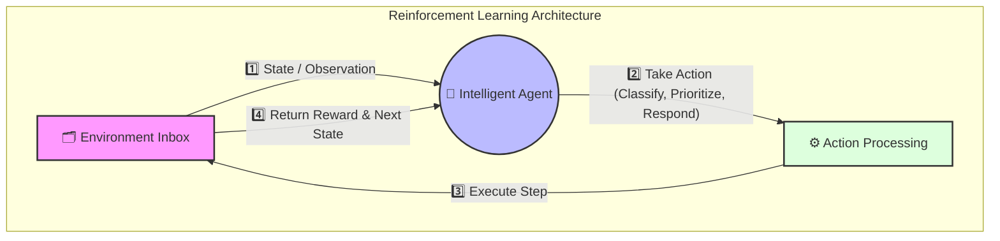

---
tags:
- openenv
---

<div align="center">
  <h1>📧 Email Classification Environment (OpenEnv)</h1>
  <p><strong><em>A dynamic reinforcement learning environment for automated inbox triage and management.</em></strong></p>
</div>

---

## 📖 Documentation

> **Documentation Focus**  
> Welcome to the official repository for the OpenEnv Email Classification Environment. This guide serves as the comprehensive **documentation** on setting up, understanding, and running agents within our custom simulated inbox.

---

## 🚀 Overview & 🎯 Motivation

### Overview
This project implements a **Reinforcement Learning (RL) style environment** for automated email processing. The system simulates real-world inbox scenarios where an intelligent agent autonomously evaluates emails to classify, prioritize, and respond based on textual content and metadata.

### Motivation
**Email overload** is a very real-world problem where critical communications are frequently missed or delayed. This environment empowers researchers and developers to build intelligent agents capable of automating inbox management, improving decision-making pipelines, and optimizing communication workflows through a robust, reward-based evaluation framework.

---

## 🧠 Environment Description & Architecture

The environment operates in a continuous RL loop:

1. **Observe:** The agent receives emails (the Observation Space).
2. **Decide:** The agent processes the logic and selects an Action.
3. **Execute:** The environment processes the action, returning a Reward and the updated State.
4. **Repeat:** The loop continues until all emails are effectively handled.

### 🏗️ Agent-Environment Architecture



---

## 📥 Observation Space

At each step, the agent receives an observation dictionary containing the current email details and previous step feedback.

**Structure:**
* `id`: `int` - Unique identifier for the email
* `subject`: `str` - Subject line of the email
* `body`: `str` - Full content payload of the email
* `true_label`: `str` - Ground truth category (`spam` / `urgent` / `normal`)
* `priority`: `str` - Importance level (`high` / `medium` / `low`)
* `last_action_result`: `str` - Feedback string from the previous environment step

---

## ⚙️ Action Space

The environment expects a specific data structure defining the agents decided action. Valid actions include:

### 1. Classification
```json
{
  "action_type": "classify",
  "email_id": 1,
  "label": "spam|urgent|normal"
}
```

### 2. Prioritization
```json
{
  "action_type": "prioritize",
  "email_id": 1,
  "priority": "high|medium|low"
}
```

### 3. Response Generation
```json
{
  "action_type": "respond",
  "email_id": 1,
  "response": "Your text response here..."
}
```

---

## 🧩 Task Descriptions & Difficulty

The agent is tasked with a multi-objective goal:
- **Correctly Classify** incoming emails as spam, urgent, or normal.
- **Assign Appropriate Priority** levels.
- **Generate Responses** when required by the context.

### Expected Difficulty Levels
- 🟢 **Easy**: Keyword-based classification (e.g., matching obvious promotional words).
- 🟡 **Medium**: Handling mixed or unclear signals, understanding subtle tones.
- 🔴 **Hard**: Context-aware reasoning, requiring advanced LLMs and multi-turn contextual memory to process urgency.

---

## 📊 Reward System

The agent's success is governed by a strict point-based reward structure.

* **Classification**
  * Correct: `+0.3`
  * Incorrect: `-0.2`
* **Prioritization**
  * Correct: `+0.2`
  * Incorrect: `-0.1`
* **Response**
  * Valid generated text: `+0.1`

---

## 🛠️ Setup Instructions

Follow these exact steps to deploy the environment locally.

### 1. Clone Repository & Navigate
Fetch the repository and move into the working directory.
```bash
git clone <your-repo-url>
cd email-env-openenv
```

### 2. Install Dependencies
Ensure you have Python installed and run the pip installation command.
```bash
pip install -r requirements.txt
```

### 3. Run the Server
Initialize the ASGI web service to host the environment interactions.
```bash
uvicorn server.app:app --host 0.0.0.0 --port 7860
```
*(Server will listen for API requests on `http://0.0.0.0:7860`)*

---

## ▶️ Usage

Interact with the environment using REST principles.

**Reset environment**
```bash
curl -X GET http://localhost:7860/reset
```

**Take an action (Step)**
```bash
curl -X POST http://localhost:7860/step \
     -H "Content-Type: application/json" \
     -d '{"action_type":"classify", "email_id":1, "label":"spam"}'
```

---

## 🤖 Inference Example

Execute an intelligent agent against the environment using the provided inference module.

**Command:**
```bash
python inference.py
```

**Expected Output:**
```text
[START]  
[STEP] step=0 action=spam reward=0.3 done=False  
[STEP] step=1 action=urgent reward=0.3 done=False  
[STEP] step=2 action=normal reward=0.3 done=True  
[END] success=True steps=3 score=0.3 rewards=[0.3, 0.3, 0.3]  
```

---

## 📈 Baseline Performance

Benchmark your agents against these initial baselines:

* **Random Agent**: `~0.1` 
* **Rule-Based Agent**: `~0.3` 
* **LLM Agent**: `>0.6` 

_This implementation uses a rule-based fallback agent to ensure stable outputs without requiring external APIs._

---

## 🔮 Future Improvements

Planned future iterations:
- Integrate state-of-the-art LLM-based reasoning directly.
- Improve contextual and semantic understanding.
- Add persistent memory and multi-step reasoning capabilities.
- Enhance and balance the active reward design.

---

## 🏁 Conclusion

This project seamlessly combines real-world applicability with reinforcement learning principles. It provides a structured and highly extensible environment foundation for building the next generation of intelligent email processing agents.
